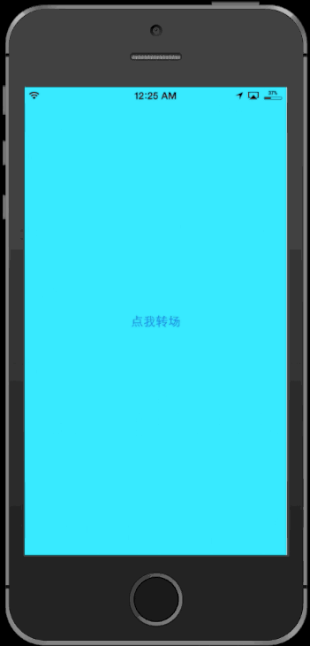
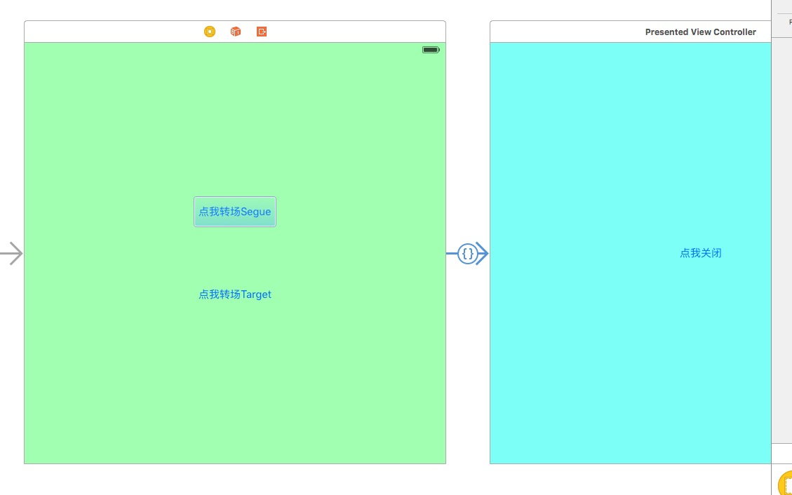

# ViewControllerTransitionTest
终于是看起转场动画了，之前一直被各种delegate所害怕，是看着动画小王子的来制作的，不过文章好像很老了，demo里面也有一些错误
[小王子的转场博客](http://www.kittenyang.com/uiviewcontrollertransitioning/)	

##步骤
用storyboard建立两个ViewController

在这里直接食用segue的时候，kitten的demo中选择了custom segue，看了一下custom是需要`Custom segues must have a custom class`,需要继承一个UIStoryboardSegue并且实现

```	
-(void)perform {
	UIViewController *src = self.sourceViewController;
	UIViewController *dst = self.destinationViewController;
	[src presentViewController:dst animated:YES completion:nil];
}
```	
#下面开始制作动画
##第一步 UIViewControllerAnimatedTransitioning
创建一个**RotationPresentAnimation**继承于NSObject的类，实现协议**UIViewControllerAnimatedTransitioning**
协议中的2个方法

```
/// 返回动画时间
- (NSTimeInterval)transitionDuration:(nullable id <UIViewControllerContextTransitioning>)transitionContext;
```

```
/// 转场时使用的动画效果，都会在这个方法中实现
- (void)animateTransition:(id <UIViewControllerContextTransitioning>)transitionContext;
```
实现2个方法

```
- (NSTimeInterval)transitionDuration:(id<UIViewControllerContextTransitioning>)transitionContext {
    return 0.5;
}

- (void)animateTransition:(id<UIViewControllerContextTransitioning>)transitionContext {
    
    // 要显示的VC
    UIViewController *toVC = [transitionContext viewControllerForKey:UITransitionContextToViewControllerKey];
    
    // 要显示VC最终的位置
    CGRect finalRect = [transitionContext finalFrameForViewController:toVC];
    // 设置要显示VC的初始位置
    toVC.view.frame = CGRectOffset(finalRect, 0, -[UIScreen mainScreen].bounds.size.height);
    
    /// 切换的转场视图都在containerView中实现
    [[transitionContext containerView] addSubview:toVC.view];
    
    [UIView animateWithDuration:[self transitionDuration:transitionContext]
                          delay:0.0
         usingSpringWithDamping:0.6
          initialSpringVelocity:0.0
                        options:UIViewAnimationOptionCurveLinear animations:^
    {
        toVC.view.frame = finalRect;
    }
    
                     completion:^(BOOL finished)
    {
        [transitionContext completeTransition:YES];
    }];
}
```

完成了2个方法之后在ViewController中加入相应的变量
```
@interface ViewController() <UIViewControllerTransitioningDelegate>

@property (nonatomic, strong)RotationPresentAnimation *presentAnimation;

@end

@implemention ViewController
- (instancetype)initWithCoder:(NSCoder *)aDecoder {
    self = [super initWithCoder:aDecoder];
    if (self) {
        self.presentAnimation = [[RotationPresentAnimation alloc] init];
    }
    return self;
}

#pragma mark - UIViewControllerTransitioning Delegate
- (id<UIViewControllerAnimatedTransitioning>)animationCOntrollerForPresentedController:(UIViewController *)presented presentingController:(UIViewController *)presenting sourceController:(UIViewController *)source {
	return self.presentAnimation;
}

@end

```
至此，present自定义动画就完成了。
##实现手势驱动的百分比切换
和present一样，我们需要创建一个`RotationDismissAnimation`继承于NSObject的类，同样实现`UIViewControllerAnimatedTransitioning`协议

```
- (NSTimeInterval)transitionDuration:(id<UIViewControllerContextTransitioning>)transitionContext {
    return 0.4;
}

- (void)animateTransition:(id<UIViewControllerContextTransitioning>)transitionContext {
    UIViewController *fromVC = [transitionContext viewControllerForKey:UITransitionContextFromViewControllerKey];
    UIViewController *toVC   = [transitionContext viewControllerForKey:UITransitionContextToViewControllerKey];
    
    // 最初始时的位置
    CGRect initFrame = [transitionContext initialFrameForViewController:fromVC];
    // 最终需要消失的位置
    CGRect finalFrame = CGRectOffset(initFrame, 0, [UIScreen mainScreen].bounds.size.height);
    
    UIView *containerView = [transitionContext containerView];
    [containerView addSubview:toVC.view];
    // 将待显示的toVC视图移至后方显示，看到的就是fromVC在前，toVC在后
    [containerView sendSubviewToBack:toVC.view];
    
    [UIView animateWithDuration:[self transitionDuration:transitionContext] animations:^{
        fromVC.view.frame = finalFrame;
    } completion:^(BOOL finished) {
        [transitionContext completeTransition:![transitionContext transitionWasCancelled]];
    }];
}

```
然后在ViewController中实现
```
- (id<UIViewControllerAnimatedTransitioning>)animationControllerForDismissedController:(UIViewController *)dismissed {
    return self.dismissAnimation;
}
```

###下面实现增加手势的方法
我们需要自定义一个`PanInteractiveTransition`继承于`UIPercentDrivenInteractiveTransition`

```
NS_CLASS_AVAILABLE_IOS(7_0) @interface UIPercentDrivenInteractiveTransition : NSObject <UIViewControllerInteractiveTransitioning>

// 整个动画时间
@property (readonly) CGFloat duration;

// 完成百分比
@property (readonly) CGFloat percentComplete;

// 动画的速度 官方建议(1 - percentComplete)*duration 主要是控制各个完成点上的速度
@property (nonatomic,assign) CGFloat completionSpeed;

// 转场进度百分比
- (void)updateInteractiveTransition:(CGFloat)percentComplete;
// 取消转场
- (void)cancelInteractiveTransition;
// 完成转场
- (void)finishInteractiveTransition;

@end
```

```
// PanInteractiveTransition.h
@interface PanInteractiveTransition : UIPercentDrivenInteractiveTransition

- (void)panToDismiss:(UIViewController *)viewController;

@end

// PanInteractiveTransition.m
@interface PanInteractiveTransition ()

@property (nonatomic, strong) UIViewController *presentedVC;
@property (nonatomic, assign) BOOL shouldComplete;

@end

@implementation PanInteractiveTransition

- (void)panToDismiss:(UIViewController *)viewController {
    self.presentedVC = viewController;
    UIPanGestureRecognizer *panGesture = [[UIPanGestureRecognizer alloc] initWithTarget:self action:@selector(panGestureAction:)];
    [self.presentedVC.view addGestureRecognizer:panGesture];
}
// 官方建议(1 - percentComplete)*duration
- (CGFloat)completionSpeed {
    return (1 - self.percentComplete) * self.duration;
}

- (void)panGestureAction:(UIPanGestureRecognizer *)gesture {
    CGPoint translation = [gesture translationInView:gesture.view.superview];
    switch (gesture.state) {
        case UIGestureRecognizerStateBegan:
            [self.presentedVC dismissViewControllerAnimated:YES completion:nil];
            break;
        case UIGestureRecognizerStateChanged: {
            CGFloat percent = MAX(translation.y / 400.0, 0);
            percent = MIN(percent, 1);
            
            [self updateInteractiveTransition:percent];
        }
            break;
        case UIGestureRecognizerStateCancelled:
        case UIGestureRecognizerStateEnded:
            if (gesture.state == UIGestureRecognizerStateCancelled) {
                [self cancelInteractiveTransition];
            } else {
                [self finishInteractiveTransition];
            }
            break;
        default:
            break;
    }
}

```

提供一个外部方法，让我们能够加入手势，然后根据滑动的范围判定多少消失
这时候在ViewController中加入相应的方法

```
- (instancetype)initWithCoder:(NSCoder *)aDecoder {
    self = [super initWithCoder:aDecoder];
    if (self) {
        self.presentAnimation = [[RotationPresentAnimation alloc] init];
        self.dismissAnimation = [[RotationDismissAnimation alloc] init];
        self.panInteractiveTransition = [[PanInteractiveTransition alloc] init];
    }
    return self;
}

- (IBAction)presentClicked:(id)sender {
    
    UIStoryboard *storyboard = [UIStoryboard storyboardWithName:@"Main" bundle:nil];
    
    PresentedViewController *pvc = [storyboard instantiateViewControllerWithIdentifier:@"Presented"];
    pvc.delegate = self;
    pvc.transitioningDelegate = self;
    
    [self.panInteractiveTransition panToDismiss:pvc];
    
    [self presentViewController:pvc animated:YES completion:nil];
}

- (void)prepareForSegue:(UIStoryboardSegue *)segue sender:(id)sender {
    PresentedViewController *pvc = segue.destinationViewController;
    pvc.delegate = self;
    pvc.transitioningDelegate = self;
    
    [self.panInteractiveTransition panToDismiss:pvc];
}

- (id<UIViewControllerInteractiveTransitioning>)interactionControllerForDismissal:(id<UIViewControllerAnimatedTransitioning>)animator {
    return self.panInteractiveTransition;
}

```

好了，目前为止百分比手势下滑的工作也完成了，但是要注意一点，在使用了`interactionControllerForDismissal:`后PresentedViewController中点击按钮dismiss的方法就失效了
所以在`PanInteractiveTransition`中需要加入相应的字断

```
// PanInteractiveTransition.h
@property (nonatomic, readonly) BOOL interacting; // 是否在交互当中

// PanInteractiveTransition.m
- (void)panGestureAction:(UIPanGestureRecognizer *)gesture {
    CGPoint translation = [gesture translationInView:gesture.view.superview];
    switch (gesture.state) {
        case UIGestureRecognizerStateBegan:
            _interacting = YES;
            [self.presentedVC dismissViewControllerAnimated:YES completion:nil];
            break;
        case UIGestureRecognizerStateChanged: {
            CGFloat percent = MAX(translation.y / 400.0, 0);
            percent = MIN(percent, 1);
            self.shouldComplete = percent > 0.5;
            
            [self updateInteractiveTransition:percent];
        }
            break;
        case UIGestureRecognizerStateCancelled:
        case UIGestureRecognizerStateEnded:
            _interacting = NO;
            if (!self.shouldComplete || gesture.state == UIGestureRecognizerStateCancelled) {
                [self cancelInteractiveTransition];
            } else {
                [self finishInteractiveTransition];
            }
            break;
        default:
            break;
    }
}

```

然后在ViewController中修改相应的协议实现方法

```
- (id<UIViewControllerInteractiveTransitioning>)interactionControllerForDismissal:(id<UIViewControllerAnimatedTransitioning>)animator {
    return self.panInteractiveTransition.interacting ? self.panInteractiveTransition : nil;
}
```

###总的来说，东西不难，少了颗钻研的心，多了对未知的恐惧😱😱😱

[ColinEberhardt的VCTransitionsLibrary](https://github.com/ColinEberhardt/VCTransitionsLibrary) 给我们提供了很多丰富精彩的动画特效
